# OpenCity

An open-world, cel-shaded arcade driving game and city simulation built in vanilla JavaScript with Three.js and the Web Audio API. Features procedural island generation, an interconnected road network graph, raycast vehicle physics with 120Hz sub-stepping, ambient AI traffic, walking pedestrians, dynamic circuit racing with CPU rivals, real-time minimap HUD, multi-input support (Keyboard, Gamepad, Mobile Touch), and zero-build static hosting.

---

## Key Features

- **Open World Island and City Generation**:
  - Procedural island with analytical shoreline warping, multi-octave Perlin elevation, coastal beaches, and mountains.
  - Graph-based road network with 4-lane cardinal avenues, 2-lane metro boulevards, 1-lane residential grids, and a continuous coast outer ring road.
  - Footpath slabs with painted lane dashes, stop lines, and zebra crossings at junctions.
  - GPU-batched city assets: skyscrapers, residential houses, fences, and patterned street lights using `THREE.InstancedMesh` with zero draw-call overhead.

- **Advanced Vehicle Physics Engine**:
  - Raycast suspension per wheel, non-linear Pacejka-inspired lateral tire slip curves, and longitudinal drivetrain traction.
  - Automatic multi-gear transmission with dynamic torque curves and RPM simulation.
  - 120Hz physics sub-stepping (1/120s step) for high-speed stability and responsive steering.
  - Dynamic weight transfer: suspension pitch dive on braking, squat on acceleration, and chassis roll in hard cornering.
  - Fully articulated 3D models with rotating tires, steering hubs, and suspension travel.

- **Living City AI Systems**:
  - **Ambient Traffic**: Civilian and commercial vehicles navigating the road network using real `Car` physics. Features automated lane adherence, off-road recovery, random 0-10s wait at T and + junctions, stop-line yielding before zebra crossings, and emergency obstacle avoidance.
  - **Pedestrians**: Animated character pedestrians traversing sidewalks and crossing over zebra crossings, with spatial cell hashing and collision avoidance.
  - **Traffic Gating**: Ambient traffic and pedestrians automatically pause and hide during competitive races.

- **Dynamic Race System**:
  - Procedural race circuit generator supporting Sprint, 1-Lap, and Multi-Lap circuits across short, medium, and long distances.
  - Holographic checkpoint gates, start countdown sequence, and finish line fanfare.
  - Intelligent CPU rivals with rubber-banding difficulty (Easy, Medium, Hard).
  - Real-time leaderboard, lap timer, best lap tracking, and race results screen.

- **Cel-Shaded Visual Pipeline**:
  - Vibrant anime/comic art style with discrete multi-tone light quantization.
  - Full-screen post-processing outline pass using normal/depth discontinuity edge detection.
  - Dynamic shadow mapping, procedural tire skid marks, tire smoke/dust particles, and high-speed wind streaks.
  - Scalable performance settings: Resolution (0.5x-1.0x), Draw Distance (250m-1km), Shadows (Off-High), Pedestrian and Traffic counts.

- **Dynamic Day, Sunset and Night Cycle**:
  - 24-hour celestial orbit with moving Sun and Moon shadows across the city and island.
  - Dynamic atmospheric transitions: sky-blue daytime, vibrant golden/orange sunset, twilight violet, and midnight blue with cool white moonlight.
  - Street lights automatically illuminate at sunset/night with crisp white glowing lamp heads, ground illumination pools, and real-time shadow casting spotlight on vehicles and pedestrians.
  - Customizable in Settings: Dynamic (1m, 3m, 8m cycles), Always Day, Always Sunset, Always Night, and Always Dawn.

- **100% Procedural Web Audio Engine**:
  - Zero external MP3/WAV audio files - all audio is synthesized in real time via Web Audio API.
  - Multi-harmonic granular engine roar with throttle load resonance and turbo blow-off whine.
  - Synthesized tire screeches, off-road gravel crunches, suspension impact thuds, and countdown chimes.

- **Multi-Platform Controls**:
  - Full support for Keyboard and Mouse, Gamepad (Xbox/PlayStation standard mapping), and on-screen Touch controls (pedals, virtual steering wheel/slider).
  - Free-Fly Camera mode (Ctrl+Shift+C) with live world simulation.

- **Zero-Build Deployment**:
  - Native ES module architecture with CDN importmap (unpkg.com/three). Deploy instantly to Vercel, Render, or GitHub Pages without build steps or bundlers.

---

## System Architecture

```mermaid
graph TD
    subgraph Core Engine
        Main[src/main.js - Game Loop and State Machine]
        Input[src/core/input.js - Keyboard / Gamepad / Touch]
        Audio[src/audio/index.js - Procedural Web Audio Engine]
    end

    subgraph World and City
        Island[src/flat/Island.js - Procedural Terrain and Shoreline]
        CityLayout[src/flat/CityLayout.js - Road Graph and Asset Placer]
        CityRoads[src/flat/CityRoads.js - Road Slabs, Kerbs and Zebra Crossings]
        CityTiles[src/flat/CityTiles.js - Instanced Mesh Batches]
        Traffic[src/flat/Traffic.js - Ambient AI Vehicles]
        Pedestrians[src/flat/Pedestrians.js - Walking Characters]
        Vegetation[src/flat/Vegetation.js - Instanced Biome Foliage]
    end

    subgraph Vehicle and Physics
        CarPhysics[src/car/physics.js - 120Hz Raycast Dynamics]
        CarMesh[src/car/mesh.js - Model Assembly and Hub Bindings]
        Camera[src/car/camera.js - Spring-Damper Chase Cam]
        DriverAI[src/car/driver.js - AI Racing Line Steering]
    end

    subgraph Racing and Gameplay
        RaceCity[src/race/city.js - Race Manager and Circuits]
        RaceRival[src/race/rival.js - CPU Competitors]
        RaceHUD[src/ui/hud.js - Minimap, Speedometer and Overlay]
    end

    subgraph Rendering Pipeline
        CelShading[src/render/cel.js - Two-Tone Cel Shaders]
        OutlinePass[src/render/outline.js - Sobel Normal/Depth Outlines]
        FX[src/fx/index.js - Skids, Dust Particles and Streaks]
    end

    Main --> Input
    Main --> CarPhysics
    Main --> Traffic
    Main --> Pedestrians
    Main --> RaceCity
    Main --> Camera
    Main --> Audio
    Main --> CelShading
    Main --> OutlinePass
    Main --> RaceHUD
    CityLayout --> CityRoads
    CityLayout --> CityTiles
    Traffic --> CarPhysics
    RaceRival --> DriverAI
    RaceRival --> CarPhysics
```



---

## Project Structure

```
opencity/
├── assets/                  # 3D GLB Models and Textures (Kenney packs)
│   ├── city/                # Metro buildings and skyscrapers
│   ├── house/               # Residential houses and cottages
│   ├── road/                # Street lights, barriers, and props
│   └── vehicles/            # Vehicle garage models
├── src/
│   ├── audio/               # Pure Web Audio API procedural synthesis
│   │   ├── ambience.js      # Environmental wind acoustics
│   │   ├── engine.js        # Synthesized granular combustion engine
│   │   ├── feedback.js      # Menu blips and skip cues
│   │   ├── finish.js        # Race completion fanfare
│   │   ├── impact.js        # Vehicle collision thuds
│   │   ├── index.js         # Master audio bus controller
│   │   ├── noise.js         # Pink and white noise generators
│   │   ├── start.js         # Race countdown beeps
│   │   └── surface.js       # Tire squeal and gravel slide noise
│   ├── car/                 # Vehicle physics and presentation
│   │   ├── camcollide.js    # Camera raycast obstacle collision
│   │   ├── camera.js        # Chase and orbit spring-damper camera
│   │   ├── driver.js        # AI race pathfollowing and cornering
│   │   ├── mesh.js          # Chassis, hub hierarchy and cel materials
│   │   └── physics.js       # 120Hz raycast suspension, slip curves and transmission
│   ├── core/                # Engine foundation
│   │   ├── frame.js         # Coordinate basis frames
│   │   ├── input.js         # Keyboard, Gamepad, Touch input mapping
│   │   ├── rng.js           # Seeded deterministic PRNG
│   │   └── util.js          # Math utilities (clamp, lerp, approach)
│   ├── flat/                # Procedural world and city systems
│   │   ├── CityLayout.js    # Graph generation, road network, building placement
│   │   ├── CityRoads.js     # Mesh generation: slabs, kerbs, zebra crossings
│   │   ├── CityTiles.js     # GPU InstancedMesh loader and manager
│   │   ├── FlatTrack.js     # Raycast ground interface
│   │   ├── FlatWorld.js     # Lighting rig and shadow configuration
│   │   ├── Island.js        # Perlin terrain elevation and shoreline warping
│   │   ├── Pedestrians.js   # Footpath walking character simulation
│   │   ├── Traffic.js       # Ambient AI traffic system (physics, junctions, stops)
│   │   └── Vegetation.js    # Instanced foliage and biome scatter
│   ├── fx/                  # Visual effects and post-processing
│   │   ├── airmark.js       # High-speed wind stream lines
│   │   ├── index.js         # Particle and skid mark manager
│   │   ├── particles.js     # Tire smoke, dust plumes, and sparks
│   │   ├── pass.js          # Render pass orchestrator
│   │   └── skids.js         # Dynamic procedural tire skid decals
│   ├── race/                # Competitive racing engine
│   │   ├── city.js          # City race generator, circuit routing, scoring
│   │   ├── countdown.js     # 3-2-1-GO visual and audio countdown
│   │   ├── ending.js        # Race finish banner and podium sequence
│   │   ├── marks.js         # Checkpoint gate holographic visualizer
│   │   ├── path.js          # Spline smoothing and race trajectory
│   │   └── rival.js         # AI rival vehicles and rubber-banding
│   ├── render/              # Cel shading and outline shaders
│   │   ├── cel.js           # Two-tone light stepping shader injections
│   │   └── outline.js       # Screen-space edge detection outline pass
│   ├── ui/                  # User Interface and HUD
│   │   ├── hud.js           # Vector minimap, speedometer, leaderboard
│   │   ├── pause.js         # ESC menu and settings view
│   │   ├── title.js         # Title screen overlay
│   │   └── touch.js         # Virtual touch controls for mobile
│   └── main.js              # Application entry point, main loop, menus
├── tools/                   # Development and validation utilities
│   ├── check.mjs            # Syntax and import validation checker
│   └── serve.mjs            # Local development HTTP server
├── index.html               # Main entry HTML with CDN importmap
├── package.json             # NPM scripts and dev tooling
└── README.md                # Project architecture and documentation
```

---

## Controls

### Keyboard and Mouse
| Action | Key / Input |
|---|---|
| **Accelerate / Throttle** | `W` or `Up Arrow` |
| **Brake / Reverse** | `S` or `Down Arrow` |
| **Steering** | `A` / `D` or `Left Arrow` / `Right Arrow` |
| **Handbrake / Drift** | `Space` |
| **Look Back (Rear View)** | `C` |
| **Orbit Camera Look** | `Mouse Movement` (Pointer Lock) |
| **Reset / Respawn Car** | `R` |
| **Pause / Menu** | `Esc` |
| **Toggle Full-Screen** | `Ctrl + F` |
| **Free-Fly Camera Mode** | `Ctrl + Shift + C` (`WASD` move, `Space` up, `Shift` down) |

### Gamepad (Standard Layout)
| Action | Button |
|---|---|
| **Throttle / Accelerate** | `RT (Right Trigger)` |
| **Brake / Reverse** | `LT (Left Trigger)` |
| **Steering** | `Left Analog Stick (Horizontal)` |
| **Handbrake / Drift** | `A / South Button` |
| **Look Back** | `Y / North Button` |
| **Reset / Respawn** | `Select / Back Button` |
| **Pause Menu** | `Start Button` |

### Mobile Touch Controls
- **Left Side**: Virtual steering slider / wheel.
- **Right Side**: Digital Throttle and Brake touch pedals.
- **Top Buttons**: Pause and Reset buttons.

---

## Traffic and Pedestrian Behavior Rules

1. **Tarmac Adherence and Recovery**: Ambient vehicles continuously verify their distance from the road centerline. If pushed off-road by collisions, they automatically realign into their lane.
2. **Zebra Crossing Stopping**: Approaching vehicles detect painted zebra crossings at junction entries, decelerating to a stop right before the stripes (`zebraStopDist`).
3. **Random Junction Wait (0-10s)**: Vehicles wait a randomized duration (0 to 10 seconds) at 3-way (T) and 4-way (+) intersections before accelerating smoothly across the junction.
4. **Pedestrian and Obstacle Yielding**: Forward sensing cones (11.0m ahead, 2.0m width) detect the player car, other traffic vehicles, and pedestrians on zebra crossings. If an obstacle is detected, emergency brakes are applied and held for up to 10 seconds.
5. **Race Hiding**: When a competitive race begins, all ambient traffic and pedestrians are instantly hidden and paused to provide an uninterrupted racing track.

---

## Getting Started and Local Development

### Prerequisites
- Node.js 18+ (for local dev server and syntax checks)
- Any modern web browser with WebGL2 and Web Audio support (Chrome, Edge, Firefox, Safari)

### Quick Start
1. **Clone the repository**:
   ```bash
   git clone https://github.com/Basharkhan7776/opencity.git
   cd opencity
   ```

2. **Start the local development server**:
   ```bash
   npm run serve
   ```
   Open your browser at `http://localhost:8000` (or the port output in your terminal).

3. **Verify syntax and parse cleanliness**:
   ```bash
   npm run check
   ```

---

## Deployment (Zero-Build Hosting)

OpenCity is designed to run with **zero build steps** using native browser ES modules and the CDN importmap in index.html:

```html
<script type="importmap">
{
  "imports": {
    "three": "https://unpkg.com/three@0.170.0/build/three.module.js",
    "three/addons/": "https://unpkg.com/three@0.170.0/examples/jsm/"
  }
}
</script>
```

### Deploying to Vercel
1. Push your repository to GitHub.
2. Import the repository in Vercel.
3. Set **Framework Preset** to `Other`.
4. Leave **Build Command** and **Output Directory** empty (static root).
5. Click **Deploy**.

### Deploying to Render / Netlify / GitHub Pages
- Host the project directory as a static site with `index.html` as the root entry point.

---

## License

This project is licensed under the ISC License. 3D assets are based on Kenney game assets (CC0 / Public Domain).
